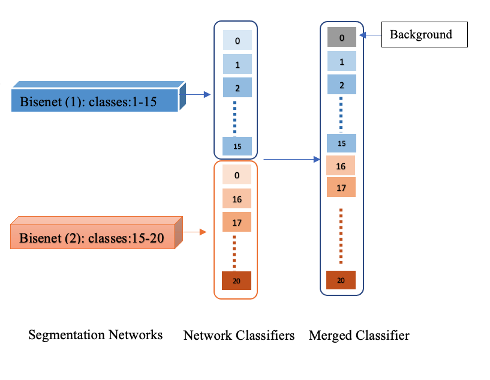

# Incremental task learning for semantic segmentation
The project is an extension based on the paper : Modeling the Background for Incremental Learning in Semantic Segmentation, june 2020 by Barbara Caputo etl.
The major contribution of the paper is about handling the background shift during semantic segmentation and catastrophic forgetting.
This project proposes incremental learning approach for semantic segmentation. Each network is trained separately on a set of classes. These trained networks are then ensembled to make a single head classifier during the inference phase.



## Notebook commands

To run tests, run the following command

```bash
!python test.py

```
For vissualizaing tensorboard: 
```bash
from torch.utils.tensorboard import SummaryWriter
%load_ext tensorboard
%tensorboard --logdir=runs

```


## Acknowledgements

 - [Modeling the Background for Incremental and Weakly-Supervised Semantic Segmentation](https://arxiv.org/abs/2201.13338)
 - [Orignal Paper Github Link](https://github.com/fcdl94/MiB)


