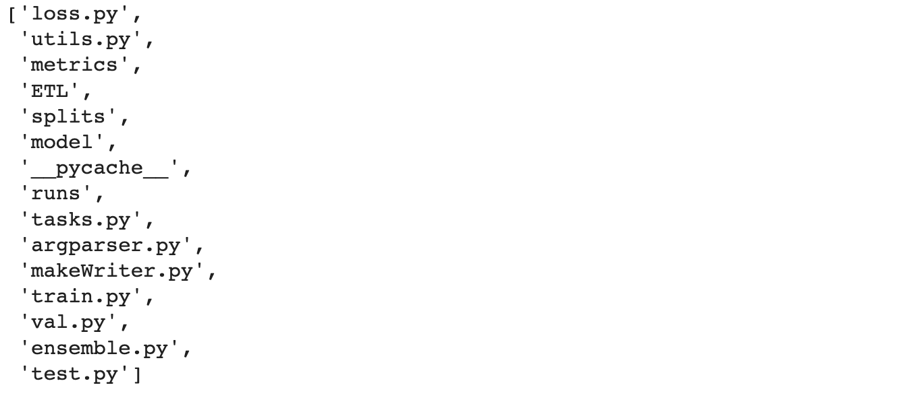
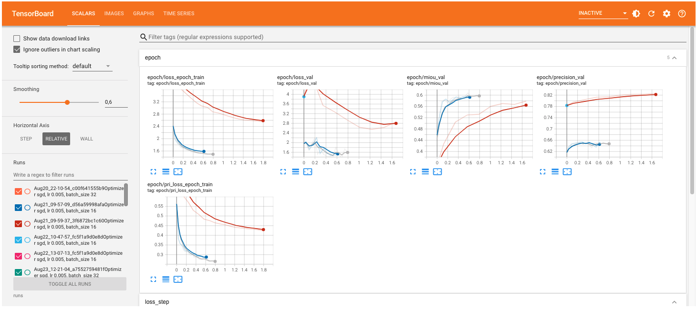

# Incremental task learning for semantic segmentation
The project is an extension based on the paper : Modeling the Background for Incremental Learning in Semantic Segmentation, june 2020 by Barbara Caputo etl.This project proposes incremental learning approach for semantic segmentation. Each network is trained separately on a set of classes. These trained networks are then ensembled to make a single head classifier during the inference phase. The project is implemented in pytorch framework.


## Notebook commands
In colab environment go to runtime -> change runtime type -> GPU
Use following command for gpu allocation:
```bash
! nvidia-smi 

```
To mount the google drive on colab:
```bash
from google.colab import drive
drive.mount('/content/root_drive', force_remount=True)

```
Locate the project directory in the file system:
```bash
import os
root_dir = "/content/root_drive/MyDrive/Project"
os.chdir(root_dir)
os.listdir(root_dir)

```

For training use:
```bash
!python train.py

```
To run tests, run the following command

```bash
!python test.py

```
For vissualizaing tensorboard: 
```bash
from torch.utils.tensorboard import SummaryWriter
%load_ext tensorboard
%tensorboard --logdir=runs

```



## Acknowledgements

 - [Modeling the Background for Incremental and Weakly-Supervised Semantic Segmentation](https://arxiv.org/abs/2201.13338)
 - [Orignal Paper Github Link](https://github.com/fcdl94/MiB)


